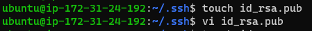

# Documentation of Auxilliary project1

a. I created a shell script and named it "onboarding.sh"

b. I created a folder named "Shell" and I moved into it
   
   `mkdir Shell && cd Shell`
   

c. I created a csv file and named it "names.csv" file
     `vim names.csv`
     

d. I changed directory to ssh folder
      `cd ssh`
      
e. I created a file for the public key and i pasted the public key in it
      `vi id_rsa.pub`
      

f. I created a file for the private key and i pasted the private key in it.
       `vi id_rsa`
        

g. I tried running some tests on the code I wrote
    `sudo groupadd developers`
    `getent group developers`
 `./onboarding.sh`
     
      

         
       

       

